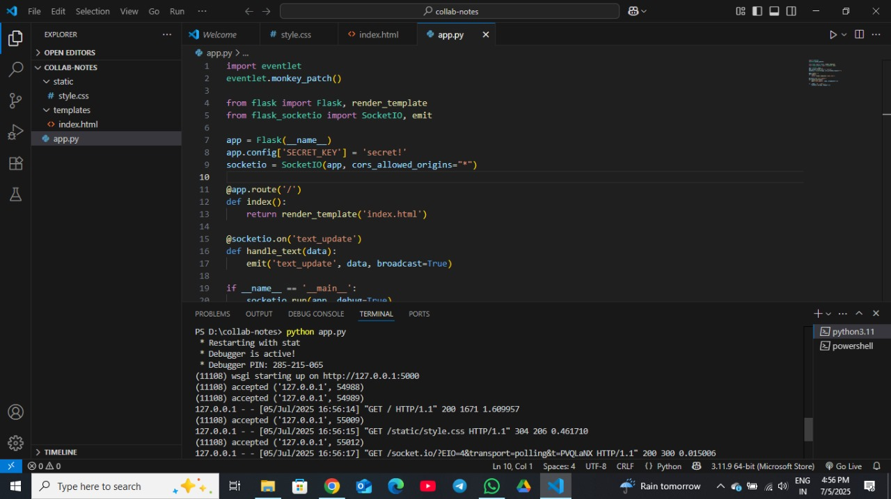
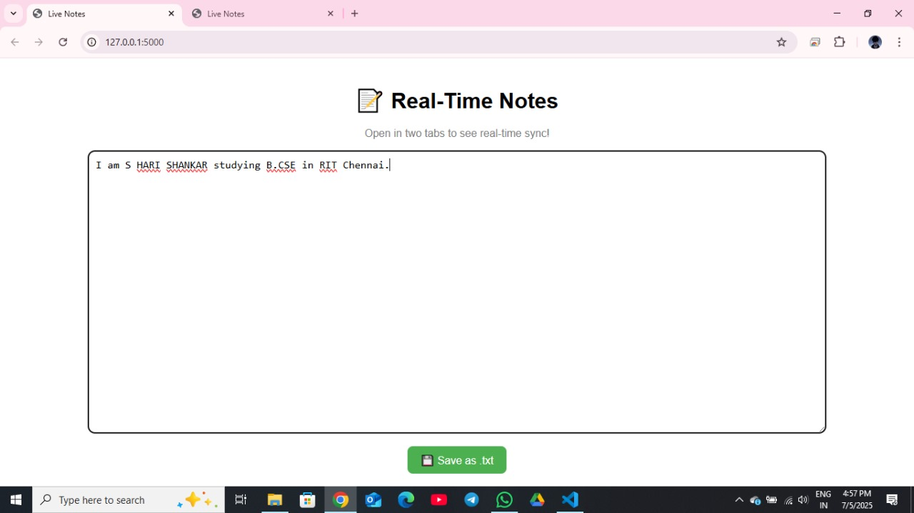
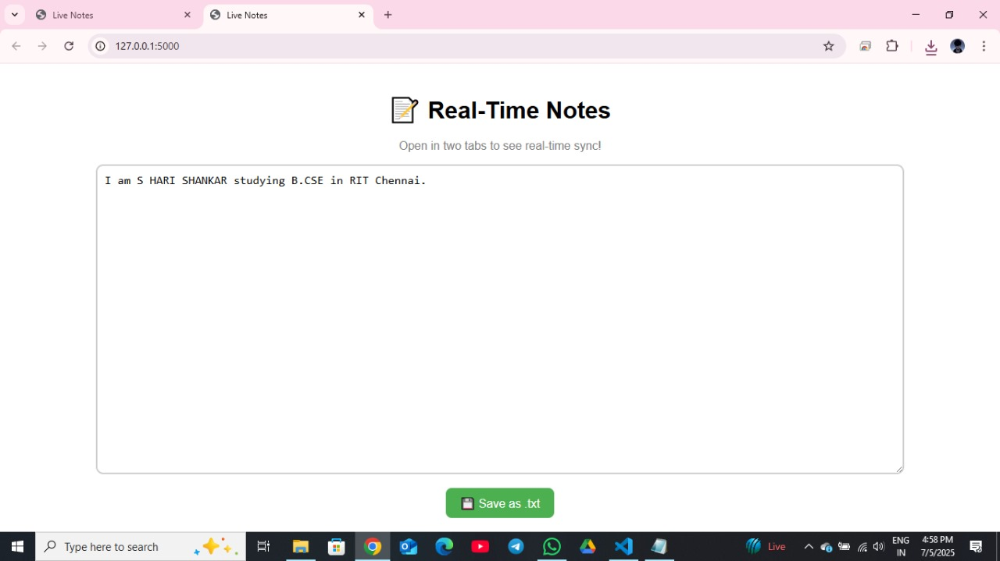
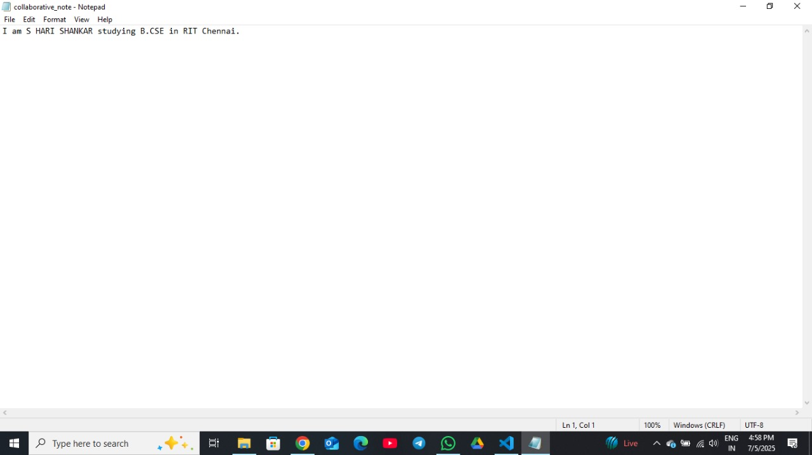

OMPANY: CODETECH IT SOLUTIONS

NAME: S HARI SHANKAR

DOAMIN: SOFTWARE DEVELOPMENT

DURATION: 4 WEEKS

MENTOR: NEELA SANTHOSH 

# 🧑‍💻 Real-Time Collaborative Tool – Internship Task 3

## 📌 Project Overview

This project is part of my internship at *CodTech IT Solutions* under *Task 3: Real-Time Collaboration Tool Development. The aim was to create a **Google Docs–like platform* that enables multiple users to collaborate on note-taking or coding in real-time.

The application is built using *HTML, **CSS, **JavaScript, **Flask, and **WebSocket* technology (via *Socket.IO*), ensuring seamless and instant updates across users.

## ⚙ How It Works

- The frontend UI is created using *HTML/CSS*, designed to be simple and user-friendly.
- Real-time collaboration is made possible using *WebSocket connections, handled via **Socket.IO*.
- *Flask* serves the backend logic and integrates with WebSocket events.
- Users can:
  - Open the platform in multiple tabs or devices.
  - See edits reflected instantly on all connected screens.
  - Save their collaborative notes as a .txt file for future use.

> Each keystroke is broadcasted to all connected users – creating a live, synced experience.

---

## ✅ Key Features

- 📄 Real-time shared text editor
- 🔁 Multi-user editing support
- 💾 Option to save notes locally
- ⚡ Instant WebSocket-based updates
- 🖥 Easy-to-use, minimal interface

---

## 🌟 Benefits

- *Hands-on WebSocket Experience*: Understand client-server communication using Socket.IO.
- *Collaborative Project Workflow*: Simulates real-world collaborative environments.
- *Multi-tab Testing*: Demonstrates how state sync works in a live, multi-user scenario.
- *Practical Flask Integration*: Combines frontend & backend in a lightweight but powerful way.
- *Reusable Architecture*: Can be expanded into live editors, coding platforms, or classroom tools.

---

## 🖼 Screenshots

Here are a few visuals demonstrating the functionality of the project.

### 📷 VS Code – Project Setup

### 📷 One Tab Opened

### 📷 Multiple Tabs Collaborating

### 📷 Notes Saved as Notepad File

> Make sure your images are stored in a folder called screenshots inside your repository. You can change the file names as per your own image files.

## 📌 Technologies Used

- HTML  
- CSS  
- JavaScript  
- Flask (Python backend)  
- Socket.IO (WebSocket protocol)  

## ✅ Conclusion

Through this project, I gained hands-on experience with real-time data exchange, collaborative programming logic, and Flask + WebSocket integration. It has improved my understanding of *multi-user state synchronization* and how to build tools for live interaction. This task was a stepping stone toward building scalable, responsive, and user-centric web applications.

## 📬 Contact

*Name:* S HARI SHANKAR  
*📱 Phone:* +91 8124607922  
*📧 Email:* hari.240123@cse.ritchennai.edu.in  
*📍 Location:* Chennai, Tamil Nadu  
*🔗 LinkedIn:* [Click Here](https://www.linkedin.com/in/s-hari-shankar-27279732b?utm_source=share&utm_campaign=share_via&utm_content=profile&utm_medium=android_app)  
*🐱 GitHub:* [Your GitHub Profile](https://github.com/harimadav)

